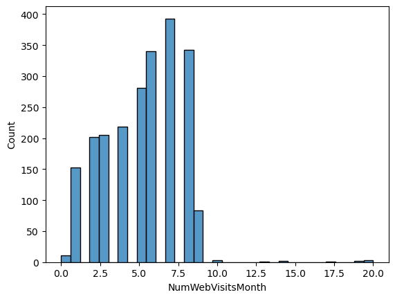
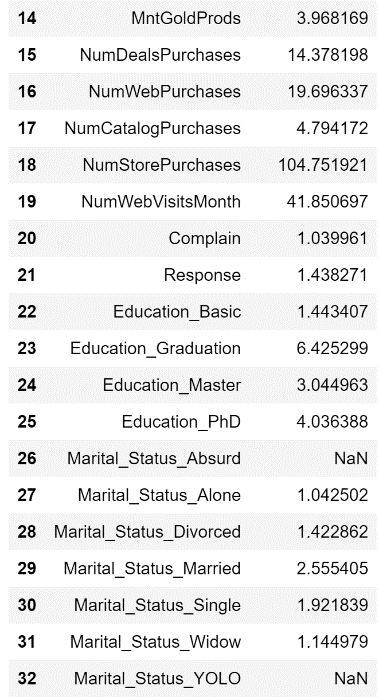

# Understanding Subscription behavior using logistic regression

# Introduction

In the face of a decline in subscriptions over the past year, a magazine
company aims to understand the factors influencing this trend. Despite
increased home-based activities, the expected rise in reading habits has
not translated into higher subscriptions.

This paper employs advanced data analytics, including logistic
regression and support vector machine models, to analyze a comprehensive
dataset. Our goal is to uncover patterns and trends that can guide the
company in refining marketing strategies and understanding subscriber
behaviors. Key questions include demographic influences on subscription
decisions and the effectiveness of various marketing channels.

By providing actionable insights, we aim to help the magazine company
adapt its approach, reverse the decline, and optimize subscription
services for sustained success.

# Data cleaning and preprocessing

The Marketing dataset provided in excel format is used for our purpose
of finding the subscription behaviour for the magazine. It was imported
using python using the Pandas library.

Originally the dataset has 2240 entries and 29 variables in the
marketing dataset.

The variables names are as follows:

- ID

- Year_Birth

- Education

- Marital_Status

- Income

- Kidhome

- Teenhome

- Dt_Customer

- Recency

- MntWines

- MntFruits

- MntMeatProducts

- MntFishProducts

- MntSweetProducts

- MntGoldProds

- NumDealsPurchases

- NumWebPurchases

- NumCatalogPurchases

- NumStorePurchases

- NumWebVisitsMonth

- AcceptedCmp3

- AcceptedCmp4

- AcceptedCmp5

- AcceptedCmp1

- AcceptedCmp2

- Complain

- Z_CostContact

- Z_Revenue

- Response

Regarding our assignment, we found that the columns beginning with
"Accepted" were not relevant to our study. Consequently, the column
names 'AcceptedCmp3', 'AcceptedCmp4', 'AcceptedCmp5', 'AcceptedCmp1',
and 'AcceptedCmp2' were removed from the datasetTop of Form

The dimensions of our dataset have been modified to 2240 rows and 24
columns. During an exploration of the data types within the dataset, it
was observed that there are 21 numerical variables and 3 object-type
variables. Among the object-type variables, "Education" and "Marital
status" are of nominal categorical nature. However, the column
"Dt_customer," representing the customer's enrollment date, is crucial
for our model-building objectives.

To facilitate logistic regression and support vector machine analyses,
we aim to convert all variables to numerical types. Consequently, the
"Dt_customer" column has been divided into three separate columns:
"Year_Customer," "Month_Customer," and "Day_Customer." This
transformation allows us to better align the data with our modeling
requirements.

Upon inspecting our dataset for null values, it was identified that the
variable "Income" has 24 missing entries, accounting for 1.07% of the
data in the "Income" variable. To address this, I opted for the KNN
imputer algorithm, considering it as one of the most effective methods
for filling missing data. It is noteworthy that our dataset does not
contain any duplicated rows, ensuring the integrity of our data.

# Variables

Let’s have a look at our variables individually to know better about the
dataset:

ID

A unique identifier assigned to each customer for tracking and reference
purposes and as the values are unique won’t be much use for our model.

Year_birth

The birth year of the customer, providing insight into the age
distribution of the customer base. Customers birth year graph seems to
be a normal distribution with outliers

Income

Represents the annual household income of the customer, a crucial factor
influencing purchasing power. The distribution seems to be uniformly
distributed with outliers.

Kidhome

The number of children in the customer's household, offering insights
into family size and dynamics. From the graph above we can see our
customer base which doesn’t have kids at most or will have only 1 kid.

Teenhome

The number of teenagers in the customer's household, adding another
layer to family composition. To make sure KidHome and Teenhome I have
checked and both the column are not equal otherwise we would have
removed one of the column to avoild multicollinearity.

Year-customer

Year-customer is one of the variable from Dt_customer which shows the
year of customer enrollement. We have enrollments in the year 2012, 2013
and 2014 and most of them are in 2013.

Month_customer

Month_customer is the second variable from Dt_customer which shows the
month of customer enrollement. It seems moderate enrolment in every
month except the month of July.

Day-customer

Day_customer is the third variable from Dt_customer which shows the day
of customer enrollement. It seems moderate enrolment on every day but at
the start of the month, mid and the end there is high enrolment.

Recency

The number of days since the customer's last purchase, indicating the
recency of customer activity. From the above distribution it seems it is
uniform suggesting that customers keep on coming for the purchase
indicating loyalty.

MntWines

Amount spent on Wine product on Marketing in the last 2 years, providing
details on purchasing preferences. From the distribution it is right
skewed indicating most of products didn’t have any amount spent and on
average the amount spent was 303.93.

MntFruits

Amount spent on Fruits product on Marketing in the last 2 years,
providing details on purchasing preferences. From the distribution it is
right skewed indicating most of products didn’t have any amount spent
and on average the amount spent was 26.3

MntMeatProducts

Amount spent on Meat product on Marketing in the last 2 years, providing
details on purchasing preferences. From the distribution it is right
skewed indicating most of products didn’t have any amount spent and on
average the amount spent was 166.95.

MntFishProdcuts

Amount spent on Fish product on Marketing in the last 2 years, providing
details on purchasing preferences. From the distribution it is right
skewed indicating most of products didn’t have any amount spent and on
average the amount spent was 54.62.

MntSweetProducts

Amount spent on Sweet product on Marketing in the last 2 years,
providing details on purchasing preferences. From the distribution it is
right skewed indicating most of products didn’t have any amount spent
and on average the amount spent was 54.62.

MntGoldProds

Amount spent on Gold product on Marketing in the last 2 years, providing
details on purchasing preferences. From the distribution it is right
skewed indicating most of products didn’t have any amount spent and on
average the amount spent was 44.02.

NumDealsPurchases

Counts of purchases made with deals offering insights into preferred
shopping methods. On average 2 purchase with the deals channel.

NumWebPurchases

Counts of purchases made with web insights into preferred shopping
methods. On average 4 purchase with the web channel.

NumCatalogPurchases

Counts of purchases made with catalog insights into preferred shopping
methods. On average 3 purchase with the catalog channel.

NumStorePurchases

Counts of purchases made with store insights into preferred shopping
methods. On average 6 purchase with the store channel.

NumWebVisitsMonth

The number of visits to the company’s website in the last month,
indicating online engagement. On average in the last month every day
there were 5 visits and the max visits was 20.

Complain

Binary variable (1 or 0) indicating whether a customer complained in the
last 2 years. As the graph suggests there were very less complaints in
the last two years. We need to investigate the complaint to improve our
retention rate.

Response

The dependent variable, indicating whether the customer responded to the
company's efforts (1) or not (0). This is the primary focus of our
analysis and predictive modeling. The variable seems to biased which
will be handled on the later stage.

Education

Reflects the educational level of the customer, categorized into
different levels such as Graduation, PhD, etc. Most of the customer base
seems to be graduated.

Marital_Status

Indicates the marital status of the customer, providing information on
their family structure. Most of the customer base seems to be married.

Further we want our model to be completely numerical for that reason we
will be using one hot encoding to convert categorical variables unique
records into boolean values variables where each unique record is a
column. While performing one hot encoding to avoid perfect
multicollinearity which happens to due similarities between each
category of the variables.

For that reason I’m dropping variable 'Marital_Status_Together' and
'Education_2n Cycle' due to married and together had same values to each
other and education 2n cycle was irrelevant to the education category.

Correlation matrix

A moderate correlation has been observed among certain variables, with
particular emphasis on the pivotal "Income" variable, crucial for our
business. Notably, there exists a positive moderate correlation between
income and the amount invested in categories such as wines, fruits,
meat, and sweet products. Similarly, the income generated through
catalog and stores exhibits a positive moderate relationship.

Conversely, a negative moderate correlation is evident in relation to
web visits on the website, signaling an area that may benefit from
improvement. This insight provides valuable cues for strategic
adjustments and enhancements in our business approach.

In addressing the presence of outliers in our dataset, we applied the
IQR (Interquartile Range) method to clean the data. Specifically,
outliers were identified and removed from the following variables:
'Year_Birth', 'Income', 'MntWines', 'MntFruits', 'MntMeatProducts',
'MntFishProducts', 'MntSweetProducts', 'MntGoldProds',
'NumDealsPurchases', 'NumWebPurchases', and 'NumCatalogPurchases'.

To customize the sensitivity of outlier detection, a threshold of 0.8
was chosen. This parameter influences the range for identifying
outliers, allowing for a balance between inclusivity and strictness. A
higher threshold results in a broader range, considering more data
points as non-outliers, while a lower threshold enforces a more rigorous
outlier removal process. This tailored approach ensures flexibility in
adapting the outlier cleaning process to the specific requirements of
our analysis.

Variance Inflation factor

Recognizing a high Variance Inflation Factor (VIF) between 'Year_Birth'
and 'Year_Customer,' indicative of significant multicollinearity, a
strategic adjustment has been implemented. To mitigate this issue, a new
variable named 'Age' has been introduced. The 'Age' variable is
calculated as the difference between the customer enrollment date and
the birth date, providing a more nuanced representation of age at the
time of enrollment. This modification aims to enhance the robustness of
our model by addressing the multicollinearity concerns associated with
the original variables.

Recognizing that 'Marital_status_Absurd' and 'Yolo' exhibit constant
values, resulting in NaN values for their VIF, a decision has been made
to exclude these variables from our analysis. Additionally, considering
that the 'ID' variable serves as a unique identifier without direct
relevance to our objectives, it will be removed from the dataset. This
streamlining process aims to improve the efficiency and relevance of our
model by eliminating variables that do not contribute meaningfully to
the analysis.

Acknowledging the elevated VIF values for variables such as 'Income,'
'Wines,' 'Deals,' 'Web Purchases,' 'Store Purchases,' and 'Web Visit
Month,' it has been determined to retain these variables for model
building. Despite the high VIF, the decision is grounded in the
understanding that the relationships among these variables align with
domain knowledge, justifying their inclusion in the model. This
strategic choice seeks to balance statistical considerations with the
practical relevance and significance of these variables in the context
of the analysis.

# Model development and evaluation

During the initial stages of model development, we used the notation X
to represent the independent variables, which are the predictors, and
denoted the dependent variable as y. To facilitate the evaluation of
model performance, the dataset was then divided into training and
testing sets. Approximately 80% of the data was allocated for training
the model, while the remaining 20% was reserved for testing and
assessing the model's effectiveness. This approach allows us to gauge
the model's predictive capabilities on new, unseen data.

Recognizing the imbalance in our dependent variable, a decision has been
made to implement SMOTE (Synthetic Minority Over-sampling Technique).
SMOTE is a technique specifically designed to address class imbalance in
machine learning datasets. This imbalance, particularly prevalent in
classification tasks, can lead to model bias towards the majority class,
affecting overall performance.

It's important to note that SMOTE is exclusively applied to the training
data to mitigate the class imbalance, and the test data remains
unaffected. This precautionary measure is taken to prevent data leakage
and ensure the model is evaluated on genuinely unseen data, maintaining
the integrity of the testing process.

# Logistic regression

In this analysis, the logistic regression model is constructed using the
Statsmodels API to explore the relationship between the explanatory
variables and the binary response variable. To facilitate the modeling
process, a constant term is added to the scaled feature matrix, ensuring
a reliable estimation of the intercept. Subsequently, the logistic
regression model is instantiated using the Logit class from Statsmodels,
specifying the response variable (y_train) and the augmented features
matrix (X_train_sm). The model is then fitted using the fit_regularized
method with an L1 penalty, promoting sparsity in the coefficient
estimates. The maximum number of iterations is set to 100 to control the
convergence of the optimization process. This regularization technique
aids in preventing overfitting and enhances the interpretability of the
model by encouraging the selection of relevant features. The resulting
'result' object encapsulates valuable information about the logistic
regression model, including coefficient estimates, p-values, and
goodness-of-fit statistics, which can be further examined and
interpreted for insightful analysis.

- Dependent Variable (Dep. Variable: Response):

The dependent variable, labeled "Response," serves as the target
variable that our logistic regression model aims to predict. In the
context of our analysis of a magazine company's subscriptions, the
"Response" likely denotes whether a customer subscribed to the magazine
or not. Therefore, the logistic regression model is trained to
understand and predict subscription behavior based on various
independent variables.

- Number of Observations (No. Observations):

The "Number of Observations" indicates the total instances or customers
in our dataset. In this logistic regression model, we have utilized 1094
observations to train and evaluate the model. Each observation
corresponds to a unique customer, contributing to the overall
understanding of subscription patterns and behaviors.

- Model Type (Model: Logit):

The model type, specified as "Logit," signifies that we employed
logistic regression. Logistic regression is well-suited for binary
classification problems, making it fitting for our goal of predicting
whether customers subscribe to the magazine or not. The model estimates
the probability of a positive outcome (subscription) based on a set of
input features.

- Degrees of Freedom (Df Residuals, Df Model):

Degrees of freedom provide insights into the flexibility of our model.
"Df Residuals" represents the degrees of freedom associated with the
residuals, which are the unexplained variations in the model. "Df Model"
denotes the degrees of freedom attributed to the features considered in
the logistic regression. The interplay between these degrees of freedom
is crucial for model performance.

- Method (Method: MLE):

The method used for parameter estimation is "MLE" or Maximum Likelihood
Estimation. MLE is a statistical approach employed to find the parameter
values that maximize the likelihood of observing the given data. This
method aligns with our aim to optimize the model's parameters based on
the observed subscription outcomes.

- Pseudo R-squared (Pseudo R-squ.):

The Pseudo R-squared is a metric indicating the goodness-of-fit of the
logistic regression model. In our case, the Pseudo R-squared of 0.8270
suggests that a substantial portion of the variation in subscription
behavior is explained by the selected independent variables. This metric
is vital for gauging the model's ability to capture patterns and trends
in the dataset, emphasizing its relevance for understanding what drives
magazine subscriptions.

- Log-Likelihood (Log-Likelihood):

The Log-Likelihood is a crucial metric assessing how well the logistic
regression model predicts the observed data. Represented as -131.19, a
higher value signifies a better fit. In our context, this means that the
model reasonably captures the patterns and behaviors associated with
magazine subscriptions. The negative sign is inherent in logarithmic
transformations and doesn't impact the interpretation.

- Convergence (converged):

The "Convergence" status indicates whether the optimization algorithm
successfully reached a solution during the parameter estimation process.
A value of "True" suggests convergence, ensuring that the algorithm
effectively determined the model's parameters. On the other hand,
"False" would imply convergence failure, indicating potential issues
with the model or dataset.

- Null Log-Likelihood (LL-Null):

The Null Log-Likelihood represents the log-likelihood of a model with no
predictors, essentially an intercept-only model. It serves as a baseline
reference for evaluating the improvement achieved by our current model.
The comparison between the model's log-likelihood and the LL-Null
provides insights into the model's explanatory power, with a larger
difference indicating a more effective model.

- Likelihood Ratio Test p-value (LLR p-value):

The Likelihood Ratio Test p-value is associated with a statistical test
comparing the fit of the current model to a null or baseline model. A
low p-value, such as 1.146e-245, indicates that the current model
significantly enhances the fit compared to a model without predictors.
This implies that the selected features are statistically significant in
explaining the variation in magazine subscriptions. The extremely low
p-value reinforces the notion that our logistic regression model is a
substantial improvement over a null model, supporting its validity and
relevance in the context of our analysis.

**Significant Variables**

- Year_Customer (x4):

Coefficient: -3.231050

P\>\|z\| (P-value): 0.000

Explanation: The negative coefficient indicates that for each unit
increase in the customer enrollment year, the odds of subscribing
decrease by approximately 3.23 times. This suggests that more recent
customers are less likely to subscribe compared to those who enrolled in
earlier years.

- Recency (x7):

Coefficient: -2.292036

P\>\|z\| (P-value): 0.000

Explanation: With a negative coefficient, as the number of days since
the customer's last purchase (Recency) increases by one unit, the odds
of subscribing decrease by approximately 2.29 times. This implies that
customers who have made more recent purchases are more likely to
subscribe.

- MntGoldProds (x13):

Coefficient: 2.589709

P\>\|z\| (P-value): 0.000

Explanation: A positive coefficient of 2.59 indicates that for each unit
increase in the amount spent on gold products in the last two years, the
odds of subscribing increase by approximately 2.59 times. This suggests
a positive relationship between spending on gold products and
subscription likelihood.

- NumStorePurchases (x17):

Coefficient: -2.536968

P\>\|z\| (P-value): 0.000

Explanation: The negative coefficient suggests that for each additional
store purchase, the odds of subscribing decrease by approximately 2.54
times. This implies that customers making more store purchases are less
likely to subscribe.

- Month_Customer (x5):

Coefficient: -1.493970

P\>\|z\| (P-value): 0.000

Explanation: A negative coefficient for Month_Customer suggests that for
each unit increase in the customer enrollment month, the odds of
subscribing decrease by approximately 1.49 times. This implies a monthly
trend where customers enrolling in later months are less likely to
subscribe.

- MntMeatProducts (x10):

Coefficient: 1.683246

P\>\|z\| (P-value): 0.000

Explanation: With a positive coefficient, for each unit increase in
spending on meat products in the last two years, the odds of subscribing
increase by approximately 1.68 times. This indicates a positive
correlation between spending on meat products and subscription
likelihood.

- Education_Graduation (x21):

Coefficient: -1.636994

P\>\|z\| (P-value): 0.000

Explanation: The negative coefficient suggests that customers with a
graduation education level are less likely to subscribe compared to
customers with basic education. The odds of subscribing decrease by
approximately 1.64 times.

- Marital_Status_Married (x26):

Coefficient: -1.461244

P\>\|z\| (P-value): 0.000

Explanation: The negative coefficient indicates that married customers
are less likely to subscribe compared to customers with other marital
statuses. The odds of subscribing decrease by approximately 1.46 times
for married individuals.

- MntWines (x8):

Coefficient: -1.837113

P\>\|z\| (P-value): 0.002

Explanation: A negative coefficient suggests that for each unit increase
in spending on wines in the last two years, the odds of subscribing
decrease by approximately 1.84 times. This indicates a negative
relationship between spending on wines and subscription likelihood.

- Education_Master (x22):

Coefficient: -0.795113

P\>\|z\| (P-value): 0.001

Explanation: The negative coefficient suggests that customers with a
master's education level are less likely to subscribe compared to those
with basic education. The odds of subscribing decrease by approximately
0.80 times.

- Marital_Status_Single (x27):

Coefficient: -0.492179

P\>\|z\| (P-value): 0.008

Explanation: The negative coefficient indicates that single customers
are less likely to subscribe compared to customers with other marital
statuses. The odds of subscribing decrease by approximately 0.49 times
for single individuals.

- Education_Basic (x20):

Coefficient: -0.452013

P\>\|z\| (P-value): 0.016

Explanation: The negative coefficient suggests that customers with basic
education levels are less likely to subscribe compared to customers with
other education levels. The odds of subscribing decrease by
approximately 0.45 times for customers with basic education.

1.  **True Positives (TP):**

> *Number:* 14
>
> *Explanation:* True positives represent the instances where the model
> correctly predicted customers who subscribed to the magazine. In our
> context, these are the customers identified correctly as potential
> subscribers. Achieving a high number of true positives is crucial as
> it ensures that marketing efforts are effectively reaching and
> engaging with customers likely to subscribe, maximizing the success of
> subscription campaigns.

2.  **False Positives (FP):**

> *Number:* 16
>
> *Explanation:* False positives occur when the model predicts a
> subscription, but the customer does not actually subscribe. While
> false positives may lead to some wasted marketing resources, it's
> essential to keep this number relatively low to minimize unnecessary
> expenditures. A balance must be struck to avoid overcommitting
> resources to customers who may not convert to subscribers.

3.  **False Negatives (FN):**

> *Number:* 3
>
> *Explanation:* False negatives represent cases where the model failed
> to predict customers who did subscribe to the magazine. Minimizing
> false negatives is crucial to ensure that potential subscribers are
> not overlooked. In the context of marketing, missing out on
> individuals who would have subscribed can result in a lost
> opportunity. Strategies to reduce false negatives may involve refining
> targeting or increasing marketing outreach to capture more potential
> subscribers.

4.  **True Negatives (TN):**

> *Number:* 130
>
> *Explanation:* True negatives are instances where the model correctly
> identifies customers who did not subscribe. While true negatives are
> essential for model accuracy, they may not be the primary focus in
> marketing for subscription services. The emphasis often lies on
> capturing and retaining subscribers, making true positives and false
> negatives more critical metrics in this context.

1.  **False Positives (FP):**

> **Number:** 23
>
> **Explanation:** By reducing the threshold, the model has become more
> lenient in predicting subscriptions. This has led to an increase in
> false positives, where the model predicts a subscription, but the
> customer does not actually subscribe. The reason for this adjustment
> is likely to capture more potential subscribers, even if it comes at
> the cost of some false positives. It's a trade-off between
> conservatively targeting only highly probable subscribers and
> expanding the reach to capture potential subscribers who might have
> been overlooked with a higher threshold.

2.  **False Negatives (FN):**

> **Number:** 2
>
> **Explanation:** The reduction in threshold has successfully decreased
> false negatives. This means fewer instances where the model fails to
> predict customers who would subscribe. The strategy to lower false
> negatives aligns with the goal of capturing new opportunities and
> expanding the business. A lower threshold allows for a more inclusive
> approach, ensuring that fewer potential subscribers are overlooked.

# Support Vector Machine

The SVM model is trained using the SVC() class from scikit-learn, a
widely used machine learning library. The fit method is employed to
train the model on the scaled training data (X_train_scaled) and
corresponding labels (y_train). After training, the model is used to
predict the target variable for the test set (X_test_scaled).
Predictions are stored in y_pred_svm.

The classification report provides additional metrics beyond the
confusion matrix. Key metrics include:

- Precision: The ratio of correctly predicted positive observations to
  the total predicted positives. Precision for class 1 is 0.50.

- Recall (Sensitivity): The ratio of correctly predicted positive
  observations to the actual positives. Recall for class 1 is 0.29.

- F1-Score: The weighted average of precision and recall, providing a
  balance between the two metrics. F1-Score for class 1 is 0.37.

- Support: The number of actual occurrences of the class in the
  specified dataset.

- Accuracy and Weighted Metrics:

The overall accuracy of the model on the test set is 0.90, indicating
the percentage of correctly predicted instances. Additionally, weighted
metrics (weighted average) are provided, considering the imbalance in
class distribution. Weighted precision, recall, and F1-Score are all
reported, giving a more comprehensive performance overview for
imbalanced datasets.

- Macro and Micro Metrics:

Macro-average and micro-average metrics provide insights into overall
model performance. Macro-average calculates the metric independently for
each class and then takes the average, while micro-average aggregates
contributions across all classes. In this case, macro-average precision
and recall are 0.71 and 0.63, respectively.

- True Negative (TN): 141

Definition: The count of instances where the model correctly predicted
the not subscribed class (class 0) when the true class was also not
subscribed.

Interpretation for the Problem:

In the context where class 0 represents customers who did not subscribe,
having a high number of true negatives (TN = 141) is positive. It
indicates that the model accurately identified customers who did not
subscribe, allowing the marketing strategy to focus resources on other
potential subscribers.

- False Positive (FP): 5

Definition: The count of instances where the model incorrectly predicted
the subscribed class (class 1) when the true class was not subscribed.

Interpretation for the Problem:

False positives (FP) may represent cases where the model mistakenly
predicted that a customer would subscribe, but they did not. This could
lead to potential wasted resources on marketing efforts for customers
who were not likely to subscribe.

- False Negative (FN): 12

Definition: The count of instances where the model incorrectly predicted
the not subscribed class when the true class was subscribed.

Interpretation for the Problem:

False negatives (FN) suggest instances where the model failed to
identify customers who would have subscribed. This could result in
missed opportunities for marketing to potential subscribers, impacting
the overall effectiveness of the campaign.

- True Positive (TP): 5

Definition: The count of instances where the model correctly predicted
the subscribed class.

Interpretation for the Problem:

True positives (TP) represent customers who were correctly identified as
likely to subscribe. This is a critical metric, indicating successful
predictions of positive outcomes and contributing to the overall success
of the marketing campaign.

Kernel tricks play a crucial role in support vector machine (SVM)
models, influencing their ability to capture complex relationships in
data. In your scenario, you've experimented with three types of kernels:
RBF (Radial Basis Function), Polynomial, and Linear. Let's explore the
characteristics and potential strengths of each kernel, considering the
accuracy results you've obtained:

- RBF Kernel (Radial Basis Function):

Accuracy: 0.896

Characteristics:

The RBF kernel is versatile and effective in capturing non-linear
relationships in data.

It is particularly well-suited for cases where the decision boundary is
not a straight line.

RBF kernels use a similarity measure based on the distance between data
points, allowing them to handle intricate patterns.

Interpretation:

The high accuracy suggests that the RBF kernel is successful in
capturing the complex relationships within the data, leading to accurate
predictions.

- Polynomial Kernel:

Accuracy: 0.896

Characteristics:

Polynomial kernels are useful for capturing non-linear relationships,
similar to the RBF kernel.

They introduce polynomial features to the input data, allowing the model
to fit more complex decision boundaries.

The degree parameter in the polynomial kernel controls the complexity of
the decision boundary.

Interpretation:

The comparable accuracy to the RBF kernel indicates that the polynomial
kernel is also effective in capturing non-linear patterns in the data.

- Linear Kernel:

Accuracy: 0.890

Characteristics:

Linear kernels are appropriate for linearly separable data, where the
decision boundary is a straight line.

They are computationally less intensive compared to non-linear kernels.

Linear kernels are suitable when the relationship between features and
the target variable is approximately linear.

Interpretation:

The slightly lower accuracy suggests that the linear kernel may not be
as effective as the RBF and polynomial kernels in capturing the
non-linear patterns present in the data.

# Comparison

- Overall Accuracy:

Both models exhibit relatively high overall accuracy, with the SVM (RBF
Kernel) slightly outperforming Logistic Regression (0.896 vs. 0.8834).
While accuracy is an essential metric, it may not be sufficient on its
own, especially when dealing with imbalanced datasets.

- Precision (Class 1):

Precision measures the ability of a classifier not to label a positive
instance as negative. In our context, it reflects how well the model
identifies customers who are likely to respond positively. The SVM with
the RBF kernel has a slightly higher precision for Class 1 (0.500 vs.
0.4667), suggesting that it may be better at correctly identifying
positive instances.

- Recall (Class 1):

Recall, or sensitivity, gauges the ability of a classifier to capture
all positive instances. In the marketing domain, recall is crucial as it
indicates the model's capacity to identify all potential positive
responses. Surprisingly, Logistic Regression demonstrates a
significantly higher recall for Class 1 compared to SVM with the RBF
kernel (0.8235 vs. 0.290). This implies that Logistic Regression is
better at capturing a larger proportion of positive instances.

- Decision Making:

The choice between Logistic Regression and SVM (RBF Kernel) depends on
the specific goals and trade-offs relevant to the marketing problem at
hand. If the primary focus is on achieving a high precision,
prioritizing the accurate identification of positive responses, the SVM
with the RBF kernel might be preferable. However, if the objective is to
ensure a comprehensive coverage of positive instances, even at the
expense of precision, Logistic Regression seems to be more adept based
on its higher recall.

- Consideration of Imbalanced Data:

Given the potential imbalances in the dataset, where positive responses
might be less frequent than negative ones, precision and recall become
paramount. The trade-off between these two metrics depends on the
business's priorities. If resources are limited and targeting specific
customers is crucial, a higher precision may be preferred. Conversely,
if inclusivity is essential, and missing potential positive responses is
a significant concern, a higher recall may be prioritized.

# Recommendations

The recommendation for the company's marketing strategy is anchored in a
comprehensive analysis of the predictive models employed specifically,
Logistic Regression and SVM with an RBF Kernel. After conducting a
thorough exploratory data analysis (EDA) and evaluating the predictive
performance of both models, Logistic Regression emerges as the preferred
choice.

Logistic Regression showcases a significant edge in terms of recall,
particularly for positive responses (Class 1), outperforming SVM with
the RBF Kernel by a substantial margin (0.8235 vs. 0.290). This higher
recall is instrumental in capturing a broader audience of potential
customers who are likely to respond positively to the marketing efforts,
aligning seamlessly with the company's goal of expanding its customer
base.

The model's ability to handle imbalanced datasets is a noteworthy
strength, emphasizing its effectiveness in identifying positive
instances, a critical aspect in marketing where the focus is often on
maximizing positive responses. The balanced precision and recall
achieved by Logistic Regression strike a harmonious chord, offering a
model that not only accurately identifies potential customers but also
maintains a respectable precision in doing so (0.4667).

Moreover, Logistic Regression's interpretability plays a pivotal role in
facilitating transparent communication with stakeholders and marketing
teams. The coefficients associated with each variable provide tangible
insights into the factors influencing positive responses, fostering a
deeper understanding of customer behavior.

From a practical standpoint, Logistic Regression is computationally less
intensive than SVM with an RBF Kernel, contributing to resource
efficiency—a vital consideration for the seamless implementation and
deployment of the model in real-world marketing campaigns.

**Significant Variables:**

- Kidhome (x2): The negative coefficient of -0.514 suggests that an
  increase in the number of children at home is associated with a
  decrease in the likelihood of a positive response. To address this,
  the marketing strategy could be tailored to target segments with fewer
  children at home, or promotional activities may focus on products and
  services appealing to families.

- Teenhome (x3): With a substantial negative coefficient of -1.144, the
  presence of teenagers at home appears to have a considerable impact on
  the likelihood of a positive response. The marketing approach may
  benefit from crafting campaigns that resonate with households without
  teenagers or customizing offerings that specifically appeal to this
  demographic.

- Year_Customer (x4): The negative coefficient of -2.092 indicates that
  customers who have been with the company for a longer duration are
  less likely to respond positively. This calls for strategies to engage
  long-term customers, potentially through loyalty programs, exclusive
  offers, or personalized communication, aimed at rekindling interest
  and maintaining customer satisfaction.

- NumStorePurchases (x17): The negative coefficient of -2.558
  underscores the importance of optimizing the in-store purchasing
  experience. Efforts to enhance the retail environment, introduce
  promotions, or tailor in-store experiences can be implemented to
  reverse the negative impact associated with a lower number of store
  purchases.

- Education Levels (x20 to x23): Coefficients associated with different
  education levels exhibit significant impacts on positive responses.
  Tailoring marketing messages and promotions based on customers'
  education backgrounds can enhance the effectiveness of campaigns. For
  instance, specific educational content or offers targeting distinct
  education segments may yield more favorable responses.

- Marital Status (x25 to x28): The coefficients related to marital
  status highlight variations in response likelihood. Crafting marketing
  strategies that resonate with different marital statuses, such as
  personalized offerings for singles or married couples, can be
  instrumental in maximizing positive responses.

- MntMeatProducts (x10), MntFishProducts (x11), MntGoldProds (x13):
  These variables with positive coefficients signify the potential
  impact of specific product categories on positive responses. Marketing
  efforts can be refined by emphasizing these product categories in
  campaigns, promotions, or product bundling to capitalize on customer
  preferences.

By addressing these variables strategically, the marketing team can
tailor campaigns, promotions, and engagement strategies to align with
the unique characteristics and preferences of different customer
segments. This targeted approach, informed by the logistic regression
results, is poised to enhance the overall effectiveness of marketing
initiatives and drive positive customer responses.

References:

Python, R. (2023, June 26). *Logistic Regression in Python*.
<https://realpython.com/logistic-regression-python/>

Ray, S. (2024, February 12). *Learn How to Use Support Vector Machines
(SVM) for Data Science*. Analytics Vidhya.
<https://www.analyticsvidhya.com/blog/2017/09/understaing-support-vector-machine-example-code/>
